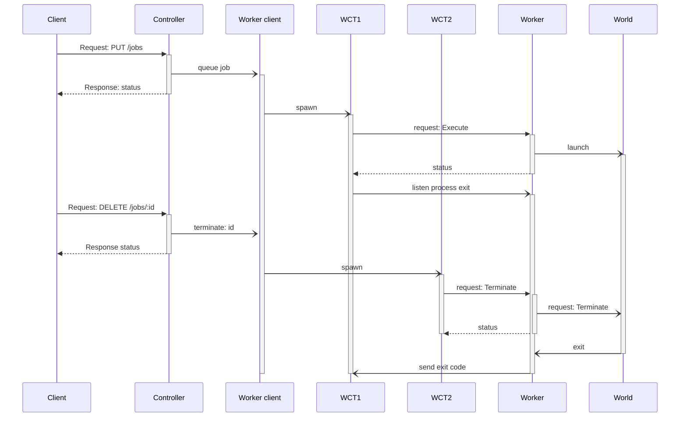

## システム間連携

```mermaid
sequenceDiagram
    activate Worker client

    Client ->>+ Controller: Request: PUT /jobs
    Controller -)+ Worker client: queue job
    Controller -->>- Client: Response: status

    participant WCT1
    participant WCT2

    Worker client -) WCT1: spawn
    activate WCT1
    WCT1 ->>+ Worker: request: Execute
    Worker -) World: launch
    activate World
    Worker -->>- WCT1: status
    WCT1 -)+ Worker: listen process exit

    Client ->>+ Controller: Request: DELETE /jobs/:id
    Controller -) Worker client: terminate: id
    Controller -->>- Client: Response status

    Worker client -) WCT2: spawn
    activate WCT2
    WCT2 ->>+ Worker: request: Terminate
    Worker -) World: request: Terminate
    Worker -->>- WCT2: status
    deactivate WCT2

    World -) Worker: exit
    deactivate World
    Worker -)- WCT1: send exit code

    deactivate WCT1

    deactivate Worker client
```